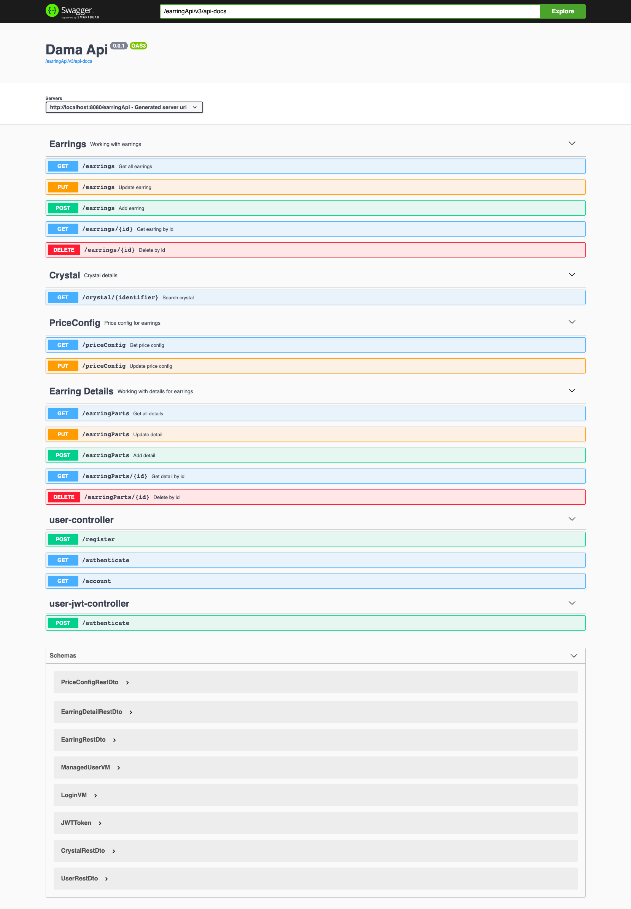

# Dama Api Service
<h3>
This service allow access to content. It uses CRUD (create, read, update, and delete) system. A
customer can create/read/update/delete new earring components and the earrings.
</h3>

## Technology Stack

<details open="open">
   <ul>
      <li><a href="#overview">Overview</a></li>
      <li><a href="#data">Data</a></li>
      <li><a href="#server-backend">Server - Backend</a></li>
      <li><a href="#libraries-plugins-and-others">Libraries, Plugins and others</a></li>
   </ul>
</details>

### <div id="overview"/> Overview 

|Technology                | Description          |
|--------------------------|----------------------|
|Core Framework            | Spring Boot2         |
|Security Framework        | Spring Security, JWT |
|Database                  | MongoDB                |

### <div id="data"/> Data 

| Technology                       |               Description   |
|----------------------------------|-----------------------------|
| [Mongock](https://mongock.io) |NoSQL Database changes tool  |
| [MongoDB](https://www.mongodb.com) |MongoDB is a free and open-source cross-platform document-oriented database program. Classified as a NoSQL database program |

### <div id="server-backend"/> Server - Backend 

| Technology                                           |                              Description                                     |
|------------------------------------------------------|------------------------------------------------------------------------------|
| [JDK 11](https://jdk.java.net/java-se-ri/11)         |Java™ Platform, Standard Edition Development Kit                              |
| [Spring Boot](https://spring.io/projects/spring-boot) |Framework to ease the bootstrapping and development of new Spring Applications|
| [Maven](https://maven.apache.org/)                   |Dependency Management                                                         |
| [JSON Web Token](https://www.jsonwebtoken.io/)       |Encode or Decode JWTs                                                         |

### <div id="libraries-plugins-and-others"/> Libraries, Plugins and others 

| Technology                   | Description                                                                                                                                                     |
|------------------------------|-----------------------------------------------------------------------------------------------------------------------------------------------------------------|
| [Lombok](https://projectlombok.org/)| Never write another getter or equals method again, with one annotation your class has a fully featured builder, Automate your logging variables, and much more. |
| [Mapstruct](https://mapstruct.org) | Code generator that greatly simplifies the implementation of mappings between Java bean types based on a convention over configuration approach.                |                                                                                                                                                               |
| [Swagger](https://swagger.io/) | Open-Source software framework backed by a large ecosystem of tools that helps developers design, build, document, and consume RESTful Web services.            |
| [git](https://git-scm.com/ )  | Free and Open-Source distributed version control system                                                                                                         |
| [Docker](https://www.docker.com/) | A set of platform as a service products that use OS-level virtualization to deliver software in packages called containers.                                     |


## Building

### Packaging as jar

To build the final jar run:

```
mvn clean install
```

We need to specify our Environment variables for the application.

~~~txt

       Configuration DB      
|------------------|-----------|
|      Variable    |   Example |
|------------------|-----------|
| DB_NAME          | dama_db   |
| DB_USER_NAME     | dama      |                                                                                        
| DB_USER_PASSWORD | damaTest  |
| DB_HOST          | localhost |
|------------------|-----------|

      Parameter for validation a token      
|------------------|--------------------------------------------------------------------------------------------------------------|
|      Variable    |                                                      Example                                                 |
|------------------|--------------------------------------------------------------------------------------------------------------|
| JWT_SECRET       | testJWTforJavaDama2021secretEarringApplicationMilkaBelarussecretDeutschDublikateaDama2021secretEarringAppl   |
|------------------|--------------------------------------------------------------------------------------------------------------|

       Parameter for Logger     
|------------------|-----------|
|      Variable    |   Example |
|------------------|-----------|
| LOG_DIR          |  ./logs   |
|------------------|-----------|
~~~

To ensure everything worked, run:

```
java -jar -Dspring.profiles.active=dev earring-details-core/target/*.jar
```
Run on local machine with embedded Mongo without presetting Environment variables:
```
java -jar -Dspring.profiles.active=local earring-details-core/target/*.jar
```

Then navigate to [http://localhost:8080/earringApi/swagger-ui.html](http://localhost:8080/earringApi/swagger-ui.html) in your browser.



### Using Docker to simplify development

Building docker image, run:

```
docker build -t dama-api-service:latest .
```
Push a new image to a registry, run:
```
docker tag dama-api-service registry-host/dama-api-service
docker push registry-host/dama-api-service
```

Example using a new image in docker-compose.yml:
```
  dama-api:
    image: registry-host/dama-api-service
    ports:
      - 8080:8080
    environment:
      DB_NAME: dama_db
      DB_USER_NAME: dama
      DB_USER_PASSWORD: damaTest
      DB_HOST: localhost
      JWT_SECRET: testJWTforJavaDama2021secretEarringApplicationMilkaBelarussecretDeutschDublikateaDama2021secretEarringAppl
      LOG_DIR=./logs
```